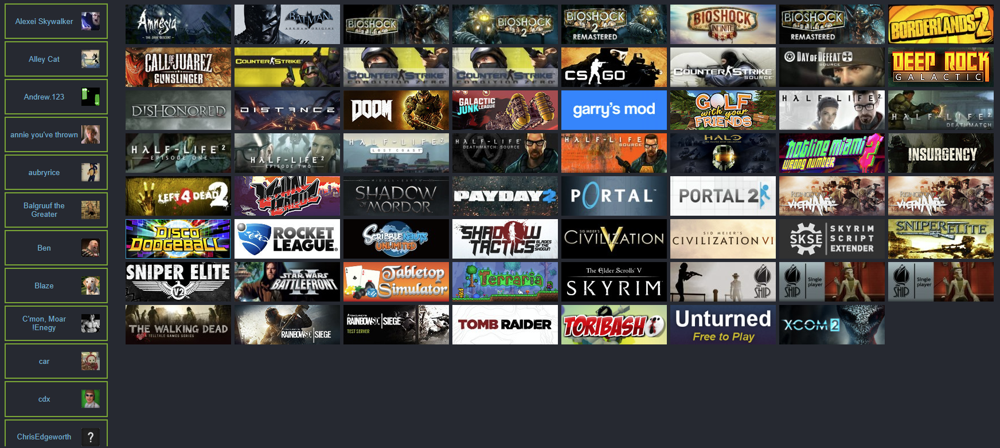
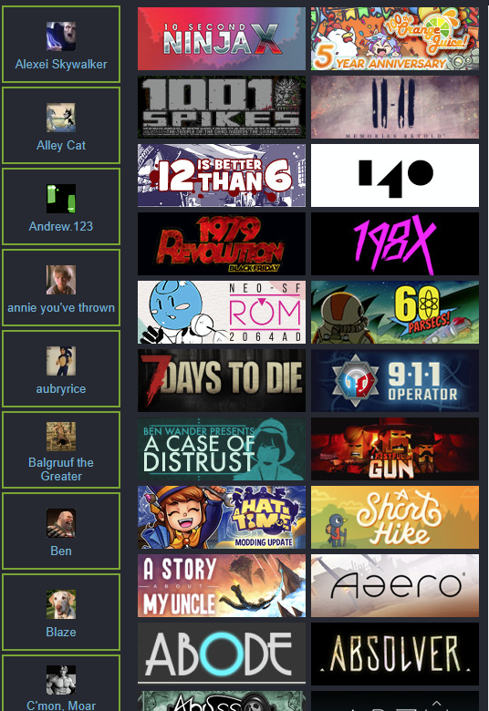

This is a test React app used for checking what games you have in common with your friends on Steam.

It is very much my first time using React, Javascript, or any sort of Web API, so some of the code is a little messy -- but it works! Everything even resizes dynamically based on the size of your screen, so it functions well on mobile devices too. I've been using this tool all the time throughout quarantine when playing games with my friends.

Setting it up yourself isn't totally seamless yet, since I haven't gotten around to setting up OAuth2.0.

In the meantime, if you want to try it out:
1) get your steam id from your steam account
2) get a steam api key (https://steamcommunity.com/dev/apikey)
3) find a proxy you like (i use https://cors-anywhere.herokuapp.com/)
4) update the file ".env" with the data you got in steps 1-3
5) run "npm install"
6) run "npm start"

Here are some screenshots of the working application:

