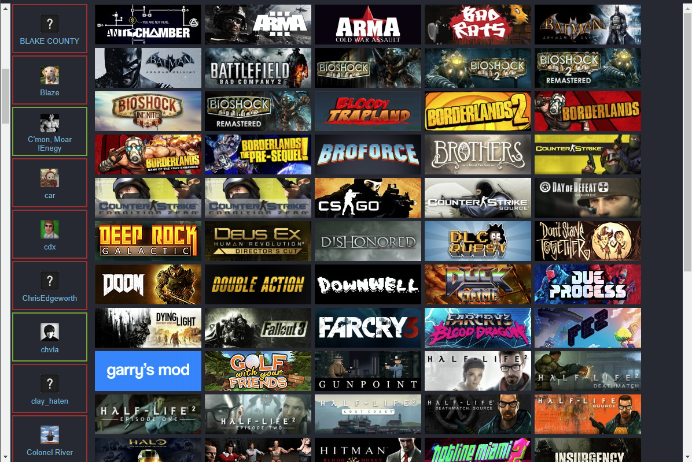

# This is a test React app used for checking what games you have in common with your friends on Steam.

The experience isn't totally seamless yet, since you're not yet able to log into your steam account.

However, you can try it out by just typing in your Steam vanity ID here: https://gamesincommon.herokuapp.com/

In the meantime, if you want to try it out:
1) get your steam id from your steam account
2) get a steam api key (https://steamcommunity.com/dev/apikey)
3) find a proxy you like (i use https://cors-anywhere.herokuapp.com/)
4) update the file ".env" with the data you got in steps 1-3
5) run "npm install"
6) run "npm start"

Here are some screenshots of the working application:

| Desktop Captures | Mobile Captures
| --- | --- |
|  |  |
|  |  |